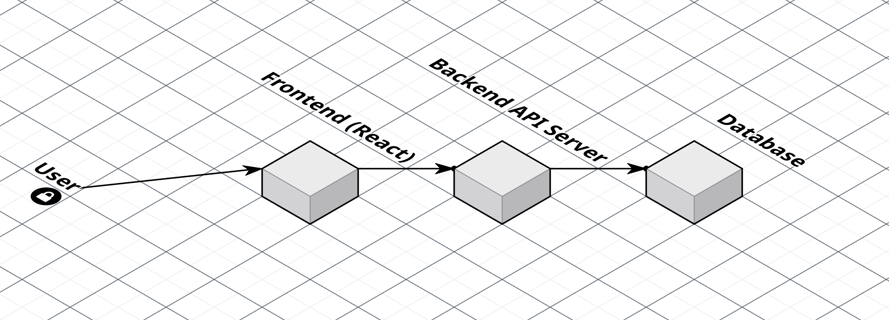
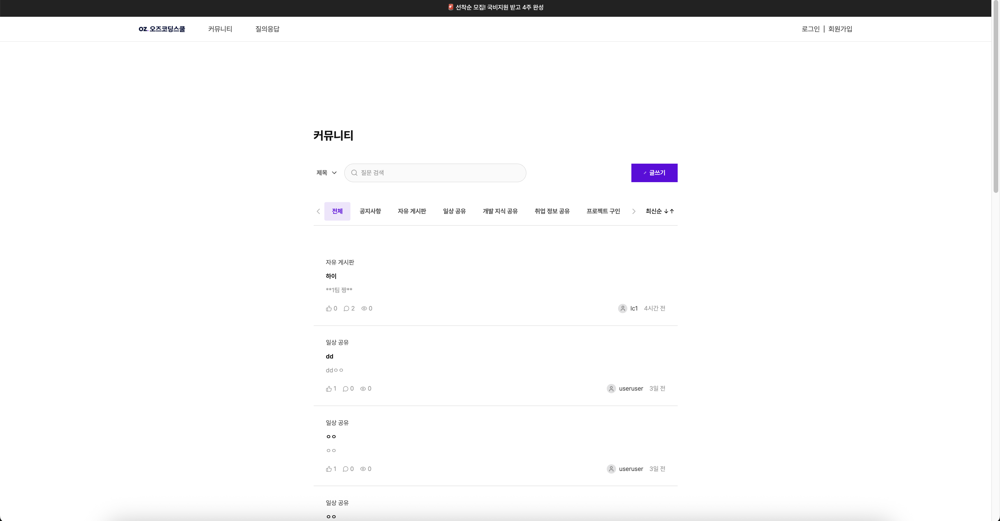
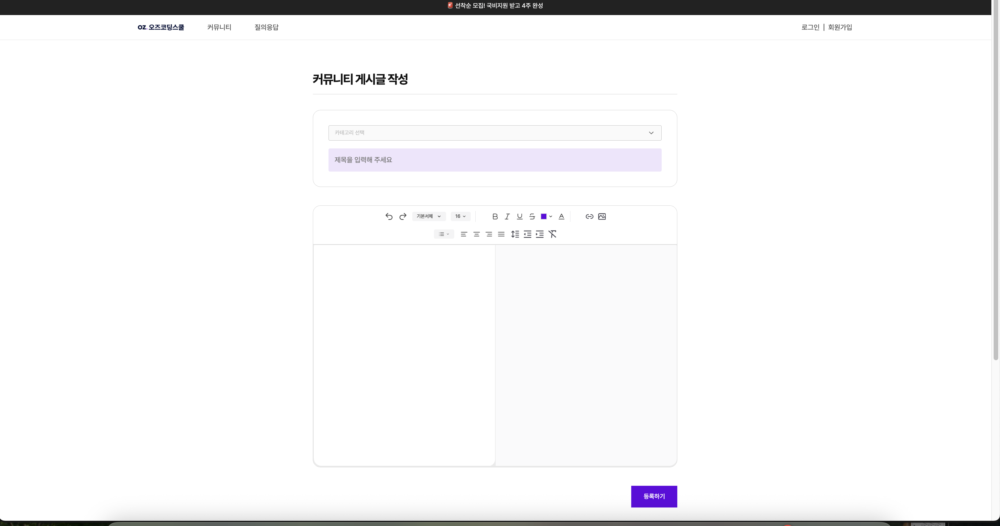
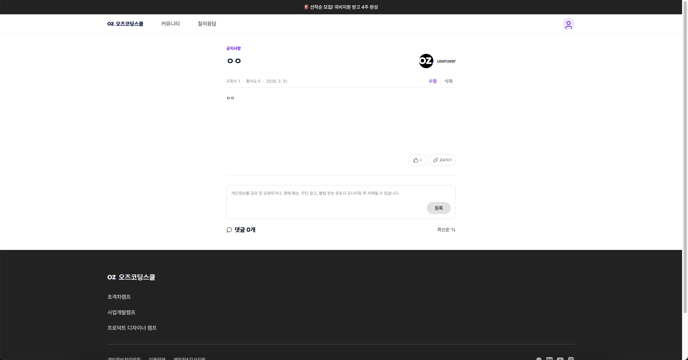
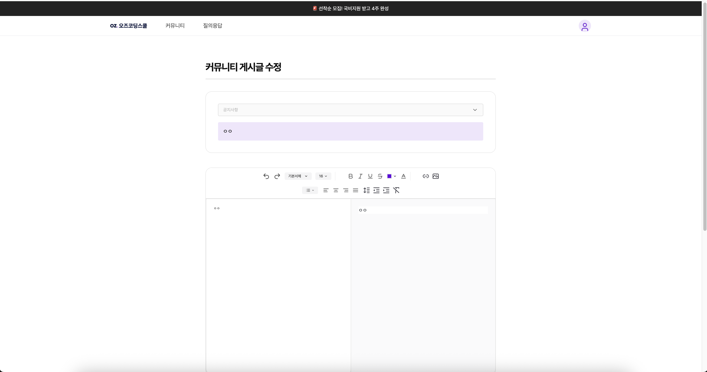

# 📌 oz_externship_fe_07_team1

커뮤니티 페이지 구현

---

## 📖 프로젝트 소개

사용자가 게시글을 작성하고 공유할 수 있는 커뮤니티 서비스입니다.  
게시글 작성, 수정, 삭제 및 댓글과 좋아요 기능을 통해 사용자 간 상호작용이 가능합니다.  
React와 React Query를 활용하여 서버 상태를 효율적으로 관리하고 API 기반 구조로 구현했습니다.

---

## 🔗 배포 링크

👉 [서비스 바로가기](https://oz-externship-fe-07-team1.vercel.app/posts)

---

## 🧩 주요 기능

- 게시글 목록 조회
- 게시글 상세 조회
- 게시글 작성 / 수정 / 삭제
- 댓글 기능
- 좋아요 기능

---

## 🛠️ 기술 스택

### Frontend

- React 19
- TypeScript
- Vite

### 상태 관리

- React Query (@tanstack/react-query)
- Zustand

### 스타일링

- Tailwind CSS
- tailwind-merge
- class-variance-authority (CVA)

### API 통신

- Axios

### 라우팅

- React Router

### 마크다운 에디터

- @uiw/react-md-editor
- react-markdown

### 아이콘

- lucide-react

### Mock 서버

- MSW (Mock Service Worker)

### 코드 품질

- ESLint
- Prettier
- Husky
- lint-staged

---

## 🏗️ 아키텍처



> 사용자 → 프론트엔드 → 백엔드 API → 데이터베이스 구조

---

## 📁 폴더 구조

```plaintext
src/
├── api/ # API 요청 함수 (axios)
│ ├── instance.ts
│ ├── apiInstance.ts
│ ├── interceptor.ts
│ ├── postAPI.ts
│ ├── commentAPI.ts
│ ├── userAPI.ts
│ └── authAPI.ts
│
├── assets/ # 이미지, 아이콘 등 정적 파일
│
├── components/ # 재사용 UI 컴포넌트
│ ├── common/ # 공통 컴포넌트
│ │ ├── Toast/
│ │ ├── Header.tsx
│ │ └── Footer.tsx
│ │
│ ├── community/ # 커뮤니티 관련 UI
│ │ └── SortButton.tsx
│ │
│ ├── editor/ # 에디터 관련 컴포넌트
│ │ └── MarkdownEditor/
│ │
│ ├── layout/ # 레이아웃 컴포넌트
│ │ └── RootLayout.tsx
│ │
│ ├── Button.tsx
│ ├── Dropdown.tsx
│ ├── Modal.tsx
│ ├── Pagination.tsx
│ ├── PostCard.tsx
│ ├── SearchBar.tsx
│ └── LikeButton.tsx
│
├── constants/ # 상수 관리
│ └── baseUrl.ts
│
├── hooks/ # 커스텀 훅
│ ├── queries/ # React Query 훅
│ │ ├── usePostQueries.ts
│ │ ├── useCommentQueries.ts
│ │ ├── useAuthQueries.ts
│ │ └── useUserQueries.ts
│ │
│ ├── useToast.ts
│ ├── usePagination.ts
│ └── useImageUpload.ts
│
├── lib/ # 공통 유틸
│ └── utils.ts
│
├── mocks/ # MSW mock 데이터 및 핸들러
│ ├── data/
│ ├── handlers/
│ └── browser.ts
│
├── pages/ # 페이지 단위 컴포넌트
│ ├── PostList.tsx
│ ├── PostDetail.tsx
│ ├── PostCreate.tsx
│ ├── PostEdit.tsx
│ └── CommunityDetailPage.tsx
│
├── store/ # 상태 관리 (Zustand)
│ ├── useAccessTokenStore.ts
│ ├── useUserInfoStore.ts
│ └── useToastStore.ts
│
├── types/ # 타입 정의
│ ├── api-request-types/
│ ├── api-response-types/
│ └── index.ts
│
├── utils/ # 기타 유틸 함수
│ ├── cn.ts
│ └── time.ts
│
├── App.tsx
├── main.tsx
└── index.css
```

---

## ⚙️ 주요 구현 포인트

- React Query를 활용한 서버 상태 관리
- Axios interceptor를 통한 인증 처리
- Optimistic Update 적용
- MSW를 활용한 API mocking
- Zustand를 활용한 전역 상태 관리 (토큰, 유저 정보)
- 컴포넌트 단위 분리 및 재사용성 고려 설계
- Markdown Editor 적용 및 실시간 미리보기 기능
- ESLint + Prettier + Husky를 통한 코드 품질 관리

---

## 📌 페이지 구성

- 게시글 목록 페이지
- 게시글 상세 페이지
- 게시글 작성 페이지
- 게시글 수정 페이지

---

## 📸 화면 미리보기

### 📝 게시글 목록 페이지



### ✏️ 게시글 작성 페이지



### 📄 게시글 상세 페이지



### 🛠 게시글 수정 페이지



## 🚀 실행 방법

```bash
# 패키지 설치
npm install

# 개발 서버 실행
npm run dev

# 빌드
npm run build

# 빌드 결과 미리보기
npm run preview
```

---

## ⚙️ 환경 변수

프로젝트 실행 전 .env 파일을 생성해주세요.

```bash
VITE_API_BASE_URL=YOUR_API_URL
VITE_MSW_BASE_URL=YOUR_MSW_URL
VITE_TEMPORARY_ACCESS_TOKEN=YOUR_ACCESS_TOKEN
```
